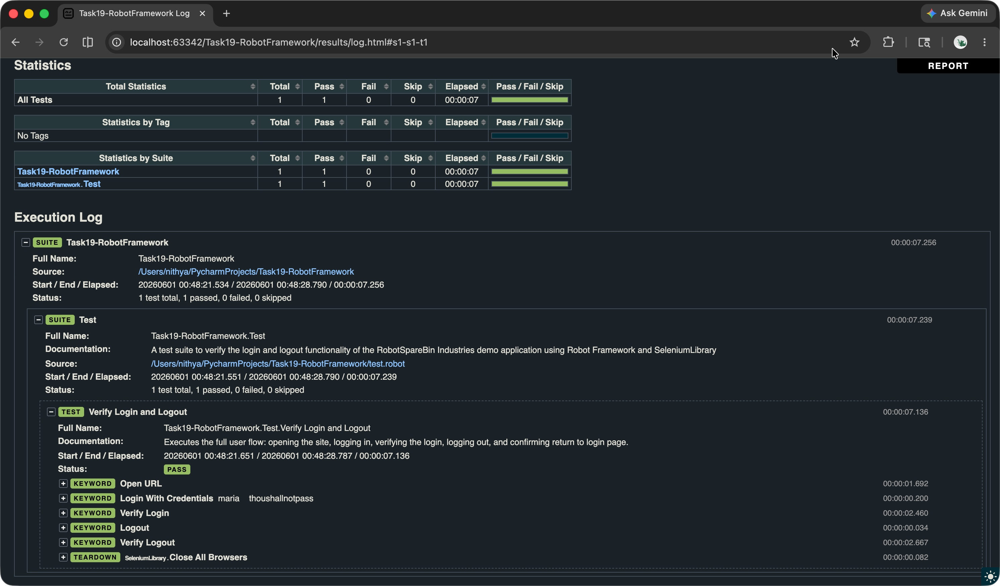

# Robot Framework Test Automation
This repo uses Robot Framework along with Selenium Library and automates Login and Logout function of RobotSpareBin Industries's Demo Application.

## 🚀 Getting Started
Follow these steps to set up and execute the test suite locally:

1. Clone the repo
2. Install requirements using the command:
```pip install -r requirements.txt```
3. Run the test using the command:
```robot test_authentication.robot```

## Framework Structure:

* Test scripts: They are present in the file [tests/test_authentication.robot](tests/test_authentication.robot) and has comments for each keywords describing their functions
* Requirements: Required libraries 'RobotFramework' and 'RobotFramework-Seleniumlibrary' are declared in the requirements.txt file
* Results: Report.html is auto-generated and placed in the results folder. Screenshots captured are also placed in this folder and auto-attached to their corresponding step in the [log.html](results/log.html) file

## Execution Log Screenshot:



